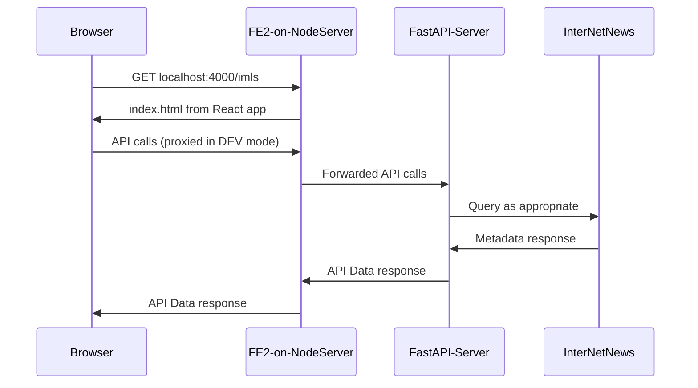

# GitHub Copilot Instructions for Open Metadata Exchange (OME)

## Project Overview

Open Metadata Exchange (OME) is a distributed, decentralized network for sharing metadata
about Open Educational Resources (OER). It enables OER libraries to publish, subscribe to,
and exchange standardized metadata across a peer-to-peer network — solving the "islands of
information" problem where each OER platform stores data in its own silo.

### Key Goals

- **Interoperability**: Enable different OER libraries to publish and subscribe to resource metadata.
- **Standardization**: A common `EducationResource` metadata format facilitates cross-platform search and sharing.
- **Decentralization**: Metadata is stored across multiple nodes for resilience and longevity.
- **Scalability**: The system handles a growing number of resources without performance degradation.

## Architecture



- **InterNetNews (INN)**: Backend storage for metadata articles (NNTP newsgroups).
- **FastAPI Server** (`server/`): Python 3.13+ middleware connecting INN to the frontend.
- **Frontend** (`frontend/`): React user interface served by a Node server on port 4000.

## Tests Must Pass Before Committing

**Every commit on every PR must have a passing test suite.** Run the
full suite and confirm it passes before `git commit`:

```bash
uv run pytest
```

- Do not commit code on a red suite — neither to open a PR nor to
  update one. Fix the failure first, or skip/xfail the specific test
  with a reason before committing.
- Pre-existing failures that are unrelated to your change (for
  example, tests that require a running NNTP server when one is not
  available) must be called out explicitly in the PR description so a
  reviewer can distinguish them from regressions.
- If your change is docs-only, confirm the baseline is clean on the
  branch you started from — a docs PR should not introduce a test
  regression.
- Delegated agents (subagents spawned via the `Agent` tool) inherit
  this requirement. When briefing an agent to land a change, remind it
  to run `uv run pytest` before committing.

## Code Quality — Always Run pre-commit

**Always run `pre-commit run --all-files` after making any code changes.**

```bash
pre-commit run --all-files
```

This project uses [`pre-commit`](https://pre-commit.com) to enforce formatting, linting,
and correctness. The hooks include:

| Hook | Purpose |
|------|---------|
| `pre-commit-hooks` | AST checks, trailing whitespace, file validation, case conflicts |
| `auto-walrus` | Walrus operator optimizations |
| `codespell` | Spell checking |
| `ruff` | Python linting and formatting (configured in `pyproject.toml`) |
| `rumdl` | Markdown linting |
| `pyproject-fmt` | `pyproject.toml` formatting |
| `validate-pyproject` | `pyproject.toml` validation |
| `uv-pre-commit` | `uv.lock` file updates |

### Setup

```bash
uv venv --python 3.13
source .venv/bin/activate
uv pip install --upgrade pip
pip install --editable .
uv tool install pre-commit
pre-commit install
```

## Python Conventions

- **Python 3.13+** is required (`requires-python = ">=3.13.0"`).
- Use [`uv`](https://docs.astral.sh/uv) for all package management.
- Follow [Ruff](https://docs.astral.sh/ruff/) rules (all rules enabled except `D`, `COM812`,
  `ERA`, `FIX002`, `ISC001`, `T201`, `TD003`).
- Use [Pydantic](https://docs.pydantic.dev/) `BaseModel` for all data models.
- Use `MappingProxyType` for immutable dict class attributes (required by `ruff rule RUF012`).
- Raise `NotImplementedError` with a message variable: `msg = "..."; raise NotImplementedError(msg)`.
- **Do not use `from __future__ import annotations`** in Pydantic model files that contain
  `datetime` fields — ruff rule `TC003` flags the runtime `datetime` import as needing a
  type-checking-only block, which breaks Pydantic's runtime validation.  Omit the future
  import and let Python 3.13 handle the annotations natively.
- Avoid where possible variables that can be polymorphic with None (s: str | None).
- Use assignment expresstions (:=) where it makes sense.

## Plugin Architecture

Plugins live in `server/plugins/<plugin_name>/` and connect external OER data sources to OME.
Each plugin inherits from `OMEPlugin` (defined in `server/plugins/ome_plugin.py`) and transforms
source-specific data into standardized `EducationResource` objects.

See `.github/skills/plugin.md` for step-by-step instructions on creating a new plugin.

Key files:
- `server/plugins/ome_plugin.py` — Base `OMEPlugin` class and `EducationResource` model.
- `server/get_ome_plugins.py` — Discovers and loads all plugins at runtime.
- `server/plugins/README.md` — Plugin architecture documentation.
- `server/plugins/eric/` — The most advanced plugin; use as the reference implementation.

## Running Locally

```bash
docker compose build
docker compose up
open http://localhost:5001
```

## Documentation

- Project docs: <https://iskme.github.io/Open-Metadata-Exchange>
- Issue tracker: <https://github.com/ISKME/Open-Metadata-Exchange/issues>
- Source: <https://github.com/ISKME/Open-Metadata-Exchange>
- License: GNU Affero General Public License v3.0
