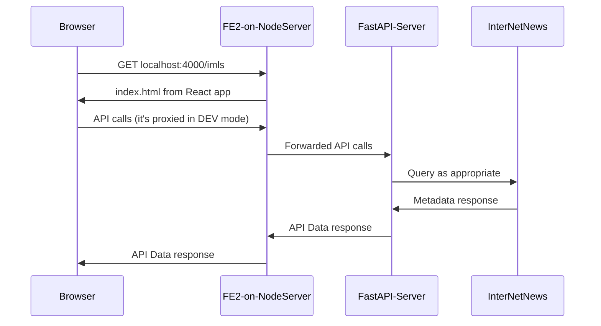

# OME Readme
Distributed / Decentralized Network for Open Metadata Exchange

[](https://github.com/ISKME/Open-Metadata-Exchange/actions/workflows/build.yml)
[](https://github.com/ISKME/Open-Metadata-Exchange/actions/workflows/sphinx.yml)

## High Level "what connects to what"



## Run the components
For local development and testing, start the INN2 server and FastAPI server with:
```bash
docker compose -f docker-compose.debug.yml up
```
* [InterNetNews](https://github.com/InterNetNews/inn) (INN) backend that houses the metadata.
    * <https://www.isc.org/othersoftware/#INN>
    * <https://www.eyrie.org/~eagle/software/inn/docs-2.7>
    * <https://github.com/cclauss/apt-get-inn2-docker>
* [FastAPI](https://fastapi.tiangolo.com/)-Server middle tier that connects the INN to the frontend.
* [FE2](./FE2/README.md) user interface that connects to the FastAPI-Server.

### FE2 NodeServer
```bash
cd fe2
npm ci
npm run start
# Wait for `webpack x.y.z compiled successfully`
open http://localhost:4000/imls
```

## Additional bits
For those wanting to "integrate" with OERCommons (either from the
local dev environment, or - with some changes to the script - the
production environment). Install [tampermonkey](https://www.tampermonkey.net/)
if you're using Google Chrome, and then install the script that is in
`tools/monkeyscript/OERCommons.tampermonkey_script.js` so that you get
a button on OERCommons details page to export items from OERCommons
into the locally running OME. This allows you to see how you might
export - in a very proof-of-concept way - from your local library
software to the OME.
