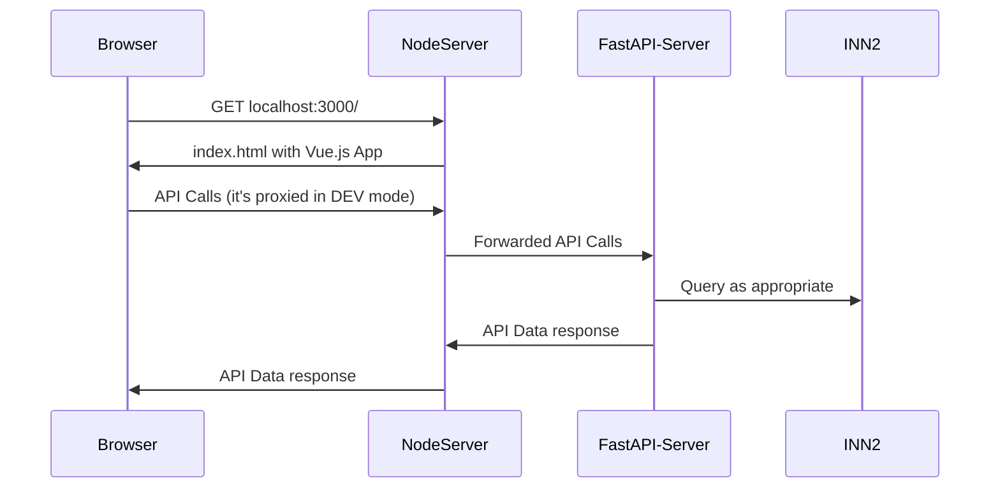

# Open Metadata Exchange (OME)
Distributed / Decentralized Network for Open Metadata Exchange

[](https://github.com/ISKME/Open-Metadata-Exchange/actions/workflows/build.yml)

## High Level "what connects to what"



## Install the components:
### [InterNetNews](https://github.com/InterNetNews/inn) will be run in a Docker container:
Also:
* [https://www.isc.org/othersoftware/#INN](https://www.isc.org/othersoftware/#INN)
* [https://www.eyrie.org/~eagle/software/inn/docs-2.7](https://www.eyrie.org/~eagle/software/inn/docs-2.7)
* [https://github.com/cclauss/apt-get-inn2-docker](https://github.com/cclauss/apt-get-inn2-docker)

### [FastAPI](https://fastapi.tiangolo.com/)-Server will be run in a Docker container:
From the project root directory

### NodeServer (Node.js Vue app)
From the project root directory
```bash
cd fe
npm install
```

## Run the components
### InterNetNews server:
For local development and testing, start the INN2 server with:
```bash
docker run --rm -t -p119:119 -p563:563 cclauss/inn
```

### FastAPI Python app:
For local development and testing, build and run the FastAPI server
in background mode and follow the logs with:
```bash
docker build --tag=fastapi-server --no-cache --progress=plain . \
  && docker run --detach --publish=5001:5001 fastapi-server \
  && docker logs -f $(docker ps -lq)
```

### FE NodeServer
```bash
cd fe
npm run dev --host=0.0.0.0
```

### FE2 NodeServer
```bash
cd fe2
npm run # To see available commands
npm run start:dev:server  # TODO (@KevinEverywhere): Is this the correct command to display the UI?
```

## Additional bits
For those wanting to "integrate" with OERCommons (either from the
local dev environment, or - with some changes to the script - the
production environment). Install [tampermonkey](https://www.tampermonkey.net/)
if you're using Google Chrome, and then install the script that is in
`tools/monkeyscript/OERCommons.tampermonkey_script.js` so that you get
a button on OERCommons details page to export items from OERCommons
into the locally running OME. This allows you to see how you might
export - in a very proof-of-concept way - from your local library
software to the OME.
