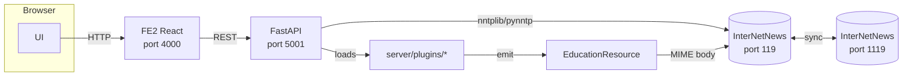

# Components

## Overview

## Component responsibilities

### FE2 (frontend)

- Serves the React SPA on port `4000`.
- Proxies `/api/*` to the FastAPI backend in dev mode
  (`fe2/webpack.config.js`).
- Owns the widget editor (GrapesJS), collection dashboards, subscribed
  channels UI.

### FastAPI server

- Lives in `server/`.
- Entry point `server/main.py`.
- REST surface in `server/routes/` (see [[../07-API-Reference/REST API]]).
- Talks to INN through `server/connection_pool.py` which hands out
  pooled `pynntp.NNTPClient` connections.
- Loads one active plugin via `CMS_PLUGIN` and inspects all installed
  plugins for newsgroup / MIME aggregation.
- Auto‑generates OpenAPI / Swagger at `/docs`, `/redoc`,
  `/openapi.json`.

### InterNetNews

- Packaged via `greenbender/inn-docker` (see
  `server_config/news_server/`).
- Persistent article store, owns `Message-ID` uniqueness, exposes
  NNTP on port `119` (per‑server).
- `server_config/news_server/dev/etc/news/` has the INN config:
  `readers.conf`, `incoming.conf`, `inn-secrets.conf`, and filter
  scripts.

### Plugins

- One directory per OER source under `server/plugins/`.
- Each plugin is self‑contained; removing its directory removes it from
  the node.
- See [[Plugin System]] and [[../05-Plugins/Plugin Registry]].

### Scripts

| Script                         | Purpose                                     |
|--------------------------------|---------------------------------------------|
| `scripts/nntp_sync.py`         | Poor‑man's NNTP peering (sync demo)         |
| `scripts/create_newsgroups.py` | Ensure all plugin newsgroups exist on INN   |
| `scripts/json_viewer.py`       | CLI viewer for article payloads             |

### `src/` module

Pure Python data model (aspirational) separate from the plugin layer.
Hosts `EducationResource` and `PedigreeRecord`. Eventually the plugin
layer should import from here; today it defines its own copies.

## Ports

| Port  | Component              | Notes                                  |
|-------|------------------------|----------------------------------------|
| 119   | INN "Austin"           | Primary demo NNTP server               |
| 1119  | INN "Boston"           | Second demo NNTP server                |
| 5001  | FastAPI (Austin)       | REST + Swagger                         |
| 5002  | FastAPI (Boston)       | REST + Swagger for second node         |
| 4000  | FE2 (Austin)           | Webpack dev server                     |
| 4001  | FE2 (Boston)           | Second frontend                        |

## Related

- [[System Architecture]]
- [[Plugin System]]
- [[NNTP Backbone]]
- [[../06-Operations/Deployment]]
