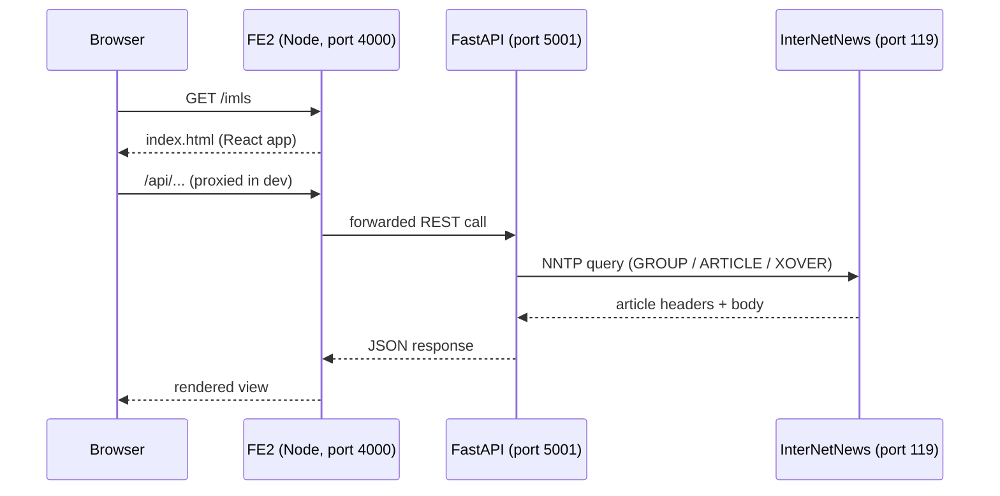

# System Architecture

An OME node is four tiers running together, usually via `docker compose`:

| Tier            | Component                     | Responsibility                                        |
|-----------------|-------------------------------|-------------------------------------------------------|
| Browser         | User agent                    | Loads the React frontend                              |
| Presentation    | **FE2** (React + webpack)     | Dashboards, widget editor, collection UI              |
| API             | **FastAPI** (`server/`)       | REST gateway between FE2 and NNTP; plugin host        |
| Storage + sync  | **InterNetNews (INN)**        | Persistent, replicated metadata store                 |

## High‑level flow

This diagram is adapted from the top‑level `README.md`.

## Two‑node demo

`docker-compose.yml` stands up *two* INN servers ("Austin" on 119 and
"Boston" on 1119) with *two* FastAPI backends and *two* FE2 frontends so
contributors can observe replication locally. `scripts/nntp_sync.py`
shuttles articles between them every five seconds — a temporary
workaround while `greenbender/inn-docker#26` is open.

See [[NNTP Backbone]] for protocol detail and [[../06-Operations/NNTP Sync]]
for the sync loop.

## Components by repository path

| Path                          | Role                                                            |
|-------------------------------|-----------------------------------------------------------------|
| `frontend/`                   | Legacy React frontend (being superseded by `fe2/`)              |
| `fe2/`                        | Current React/TypeScript frontend                               |
| `server/`                     | FastAPI app, NNTP client wrappers, plugin loader                |
| `server/plugins/`             | One directory per integrated OER source                         |
| `server/plugins/ome_plugin.py`| `EducationResource` + `OMEPlugin` base class                    |
| `server/get_ome_plugins.py`   | Loader + discovery (`CMS_PLUGIN` env var; plugin walk)          |
| `server/nntp_article.py`      | Helper that builds `EmailMessage` NNTP articles with enclosures |
| `server/ome_node.py`          | Channel/post/summary API surface used by FastAPI                |
| `server_config/news_server/`  | INN configuration (readers, feeds, filters)                     |
| `scripts/`                    | CLI utilities: `nntp_sync`, `create_newsgroups`, `json_viewer`  |
| `src/`                        | Aspirational pure data model (`EducationResource` + `PedigreeRecord`) |
| `tests/`                      | pytest suites                                                   |
| `docs/`                       | Existing Sphinx narrative docs                                  |
| `docs/vault/`                 | This Obsidian vault                                             |

## Request path (detail)

1. Browser requests `/api/channels` from FE2.
2. FE2's webpack dev server proxies to FastAPI at `:5001`.
3. FastAPI (`server/ome_node.py::channels`) opens an NNTP client via
   `connection_pool.ClientContextManager`.
4. `nntp_client.list_active()` enumerates active groups on the local INN
   server.
5. `get_newsgroups_from_plugins()` walks the installed plugins and returns
   a `{group_name: description}` mapping, which FastAPI uses to enrich
   the response.
6. FastAPI returns JSON to FE2, which renders it.

## Related

- [[Data Model]]
- [[NNTP Backbone]]
- [[Plugin System]]
- [[Components]]
- [[../09-Decisions/ADR-0001 NNTP as Backbone]]
