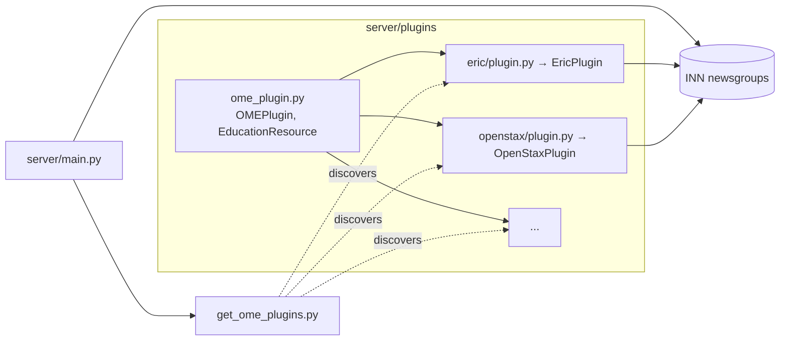

# Plugin System Overview

A plugin teaches OME how to talk to *one* OER source. It declares:

- which **MIME type** its source data has,
- which **newsgroup(s)** it publishes to, and
- how to build an [[EducationResource Model|`EducationResource`]] from
  that source's payload.

Each plugin lives in `server/plugins/<name>/` and subclasses `OMEPlugin`
from [`server/plugins/ome_plugin.py`](../../../server/plugins/ome_plugin.py).

## Two loader paths

See [[../02-Architecture/Plugin System]] for detail. In short:

- `load_plugin()` → the *one* active plugin (selected by `CMS_PLUGIN`).
- `get_ome_plugins()` → *all* installed plugins (used to build the
  newsgroup catalogue).

## Conventions

| Attribute           | Type                       | Example                                |
|---------------------|----------------------------|----------------------------------------|
| `mimetypes`         | `tuple[str, ...]`          | `("application/vnd.iskme.eric+json",)` |
| `newsgroups`        | `MappingProxyType[str,str]`| `{"ome.eric": "ERIC metadata"}`        |
| `site_name`         | `str`                      | `"Education Resources Information Center"` |
| `librarian_contact` | `str`                      | `"info@iskme.org"`                     |
| `logo`              | `str`                      | full URL                               |

Methods to implement:

- `make_metadata_card_from_json(json_payload: str) → EducationResource`
- `make_metadata_card_from_dict(doc_dict: dict) → EducationResource`
- `make_metadata_card_from_url(url: str) → EducationResource` *(optional)*

## Where to go next

- [[Writing a Plugin]] — step‑by‑step guide
- [[EducationResource Model]] — the target schema
- [[Plugin Registry]] — the plugins that ship today
- Canonical source: `.github/skills/plugin.md` (agent skill)

## Related

- [[../02-Architecture/Plugin System]]
- [[../02-Architecture/Data Model]]
- [[../09-Decisions/ADR-0002 Plugin Architecture]]
